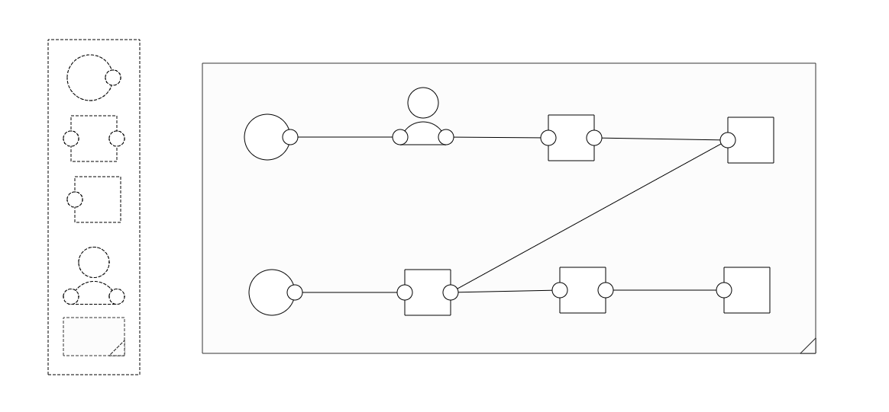

ProcessDesigner
==========

*Prototype: Drag and Drop Process Designer*

Features
--------

I've build this for demo purposes at work. We focus on operational excellence; organization processes should be in optima forma and many processes follow a flow which starts with a certain input (trigger) and continuous through a series of steps of manual checks by employees and automated steps by computers to end up to a result (output). This has been an experiment to model such a flow in a visual way.

 1. Modular design using [Paper.js](http://paperjs.org) and [JQuery](http://jquery.com)
 2. Easy to understand and customize
 3. Stand-alone for demo's and own projects!

How to Use
---------

Just clone the whole repository locally and open index.html!

*Try these things:*

 1. Hover the left bar and add elements
 2. Drag any end-point to an start-point to connect parts
